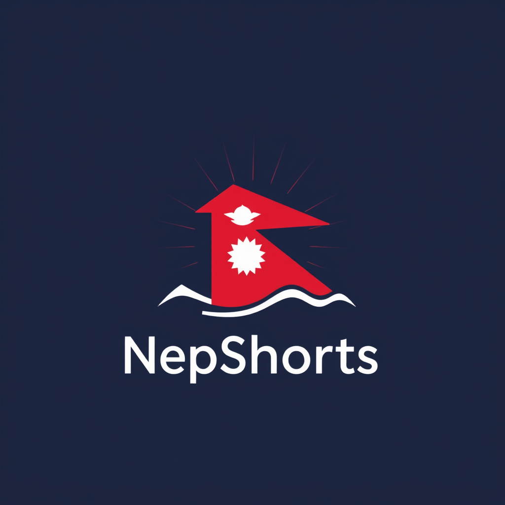

<h1>Nepshorts</h1>

**Nepshorts is an application which wraps up Nepali news in short form.**

### Download NepShorts apk file

You can download the APK file directly from the root of this repository:

1. **Navigate to the root of the repository**.
2. **Find the APK file**, named `Nepshorts.apk`.
3. **Click on the APK file** to download it.

Alternatively, you can download the APK directly using this link:

- [Download APK](./Nepshorts.apk)

Make sure to enable installation from unknown sources on your device if you're installing the APK manually.
